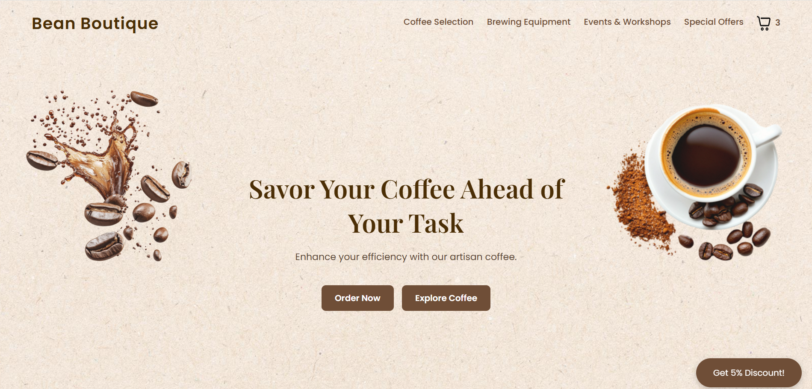
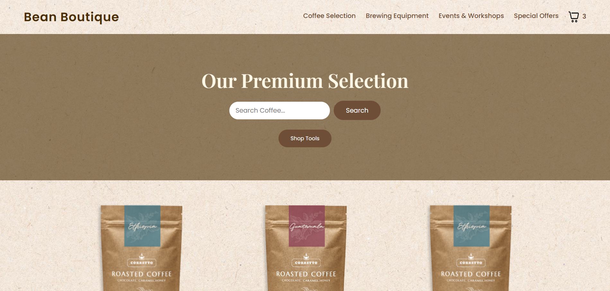
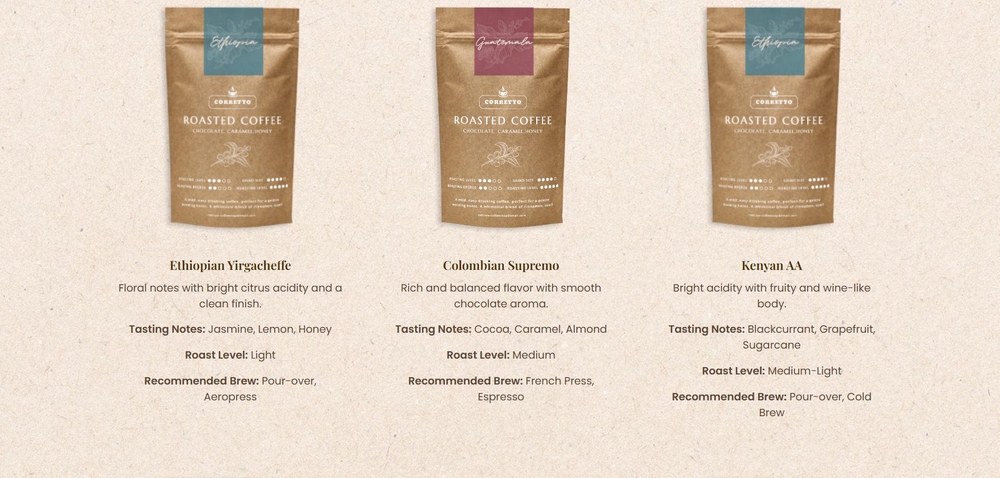
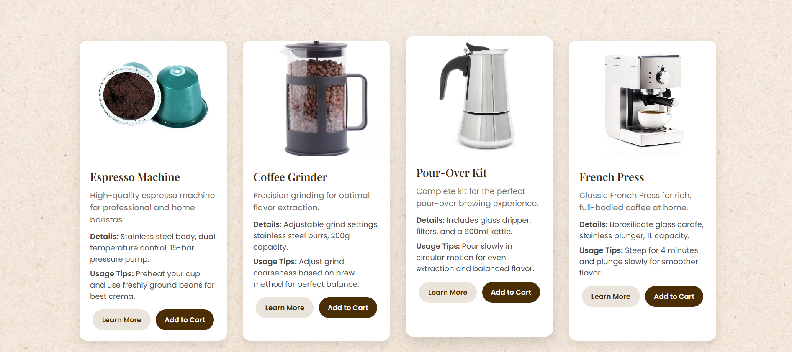
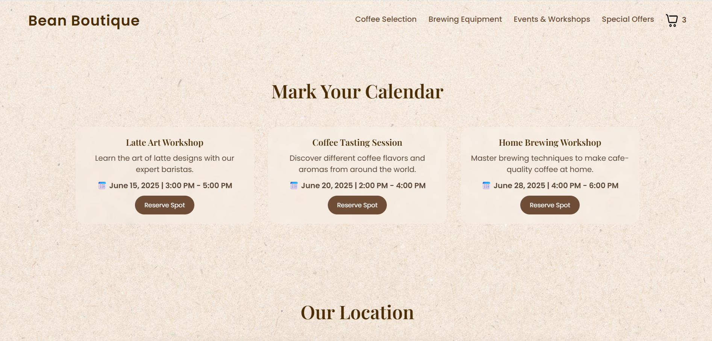
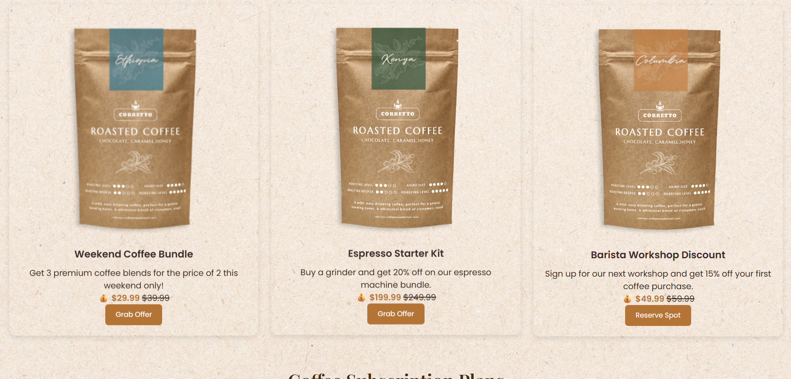
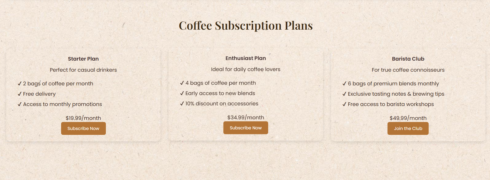
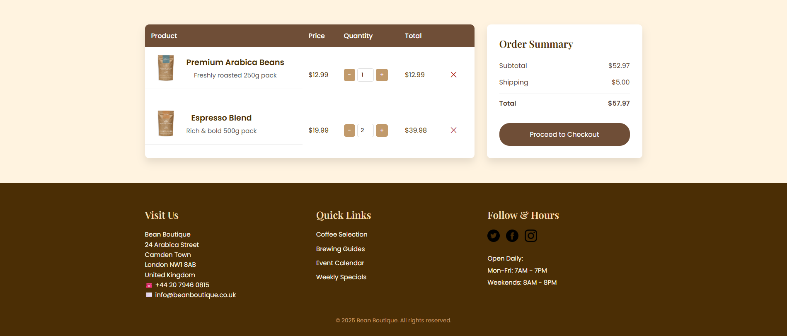

```md
# Bean Boutique Coffee Shop

## L4DC Assignment Project

A clean and responsive front-end website for Bean Boutique, a modern coffee shop brand.  
This project was developed as part of the L4DC assignment.  
The website includes coffee products, brewing equipment, events, special offers, subscription plans, and a shopping cart page.

---

## Live Preview

Add your live website link here:

https://your-live-website-link.com

---

## Project Overview

Bean Boutique is a static front-end coffee shop website built with HTML, CSS, and Vanilla JavaScript.  
The website has a warm coffee-themed design with product cards, search option, workshop section, offer section, and cart summary interface.

---

## Features

- Responsive website design
- Attractive home page hero section
- Coffee selection page with search bar
- Coffee product cards with details
- Brewing equipment section
- Events and workshops section
- Special offers section
- Coffee subscription plans
- Shopping cart and order summary page
- Newsletter / discount popup
- Google Maps location section
- Coffee-themed custom CSS design

---

## Technologies Used

- HTML5
- CSS3
- JavaScript
- Google Maps Embed
- Font Awesome Icons

---

## Pages Included

index.html
coffee.html
equipment.html
events.html
offers.html
cart.html

---

## Folder Structure

Bean-Boutique-Coffee-Shop/
│
├── index.html
├── coffee.html
├── equipment.html
├── events.html
├── offers.html
├── cart.html
│
├── css/
│   └── style.css
│
├── js/
│   └── script.js
│
├── images/
│   └── project images
│
└── screenshots/
    └── website screenshots

---

## Screenshots

---

### Home Page Hero Section



---

### Coffee Selection Page with Search Bar



---

### Coffee Product Cards and Details



---

### Brewing Equipment Section



---

### Events and Workshops Section



---

### Special Offers Section



---

### Coffee Subscription Plans



---

### Shopping Cart and Order Summary



---

## How to Run the Project

1. Download or clone the project.
2. Open the project folder.
3. Open index.html in any web browser.
4. The website will run locally.

No installation is required.

---

## Main Functionalities

### Coffee Search

Users can search coffee items from the coffee selection page.

### Add to Cart Interface

The cart page shows product name, quantity, price, subtotal, shipping cost, and total amount.

### Events and Workshops

Users can view upcoming coffee-related workshops and events.

### Special Offers

The offer page displays discount bundles, promotional offers, and subscription plans.

---

## Future Improvements

- Add real checkout functionality
- Connect the website with a backend database
- Add user login and registration
- Add payment gateway integration
- Store cart data using local storage

---

## Assignment Information

Project Name: Bean Boutique Coffee Shop Website  
Assignment: L4DC Assignment  
Project Type: Front-End Website  
Technology: HTML, CSS, JavaScript  
Purpose: Educational Assignment Project

---

## Author

Developed by MD Fahim Shahriar  
L4DC Assignment Project
---

## License

This project is created for educational purposes.
```
